# Quantitative & Behavioral Analysis — S&P 500  

**Report ID:** BTCQ-2025-3484  
**Date:** 3 November 2025  
**© 2025 Beyond the Chart | Proprietary Quantitative & Behavioral Research**

---

## Executive Summary

The analyzed S&P 500 trading system demonstrates strong initial performance followed by measurable structural decay.  
While maintaining an 84% win rate, expectancy deteriorates through volatility amplification and asymmetric loss clustering.  
Monte Carlo simulations and survival analysis confirm progressive edge erosion under variance expansion.  
Behavioral metrics reveal emotional overreach — especially during high-volatility phases — validating a link between structural and psychological instability.

---

## Abstract

This report presents a full quantitative and behavioral performance analysis on an S&P 500 trading account.  
It integrates classical risk–return statistics with behavioral diagnostics to evaluate the internal stability of the trading edge over 500 trades.  
Results reveal an accelerating drawdown frequency, deteriorating risk-adjusted returns, and tail clustering consistent with mean-reversion overload.  
Monte Carlo stress tests confirm that positive expectancy decays through asymmetric downside exposure and behavioral drift.

---

## Dataset & Methodology

- **Instrument:** S&P 500  
- **Sample:** 500 executed trades  
- **Data Frequency:** Trade-by-trade (aggregated from tick-level execution logs)  
- **Period Covered:** Up to 3 November 2025  
- **Framework:** Hybrid quantitative–behavioral model integrating volatility response, frequency drift, and edge-decay analysis  
- **Analytical Modules:**
  - Equity curve and drawdown decomposition  
  - Return distribution and QQ-plot validation  
  - Historical VaR/CVaR simulation (95–99%)  
  - Rolling Sharpe & Sortino (100-trade windows)  
  - Hurst exponent and ADF stationarity test  
  - Edge-decay modeling (rolling mean P/L trend)  
  - Monte Carlo stress testing (500 reshuffled paths)  
  - Cumulative survival probability estimation  

All computations were executed in Python (NumPy, SciPy, pandas, statsmodels, matplotlib).  
The analysis blends classical statistics with non-linear stochastic diagnostics to capture drift, persistence, and tail asymmetries.

---

## Visual Results

### Equity & Drawdown
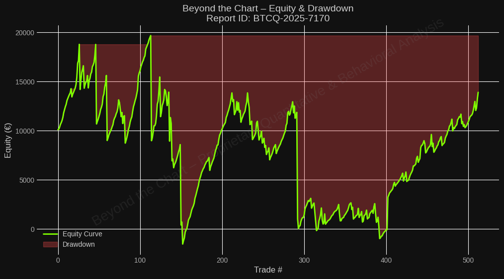

### Drawdown Profile

### Drawdown Duration

### Recovery Time Drawdown

### Rolling Sharpe & Sortino
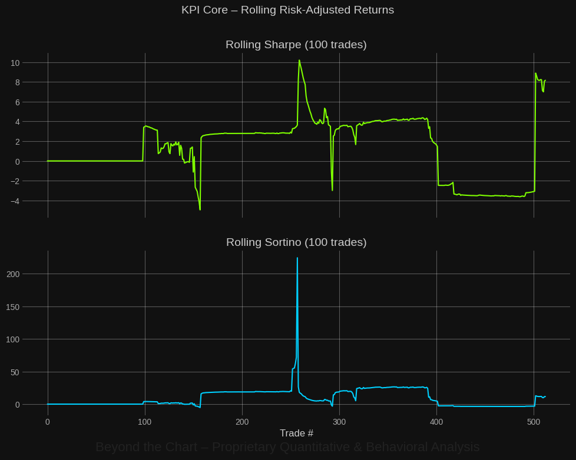

### Rolling Win Rate / Payoff Ratio
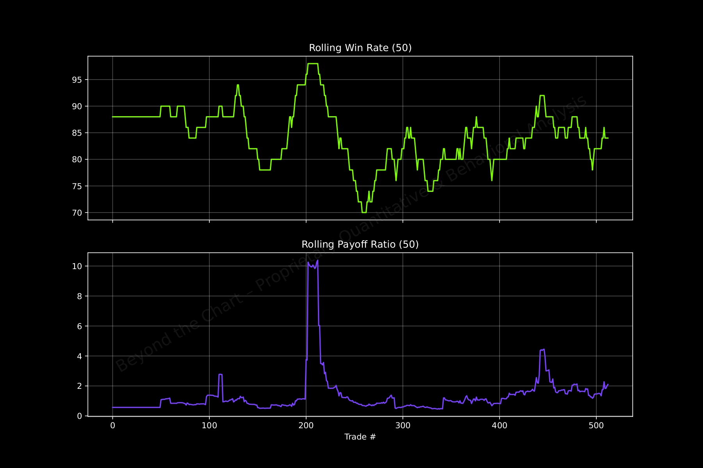

### Payoff Stability

### Risk Curve Cumulative

### Survival Probability

### Expected Annual Outcome
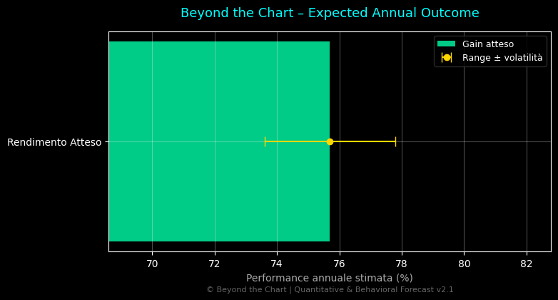

### Final Equity Distribution
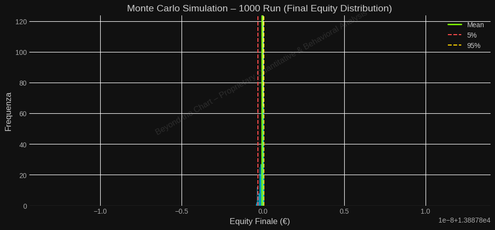

### Monte Carlo Fan Chart
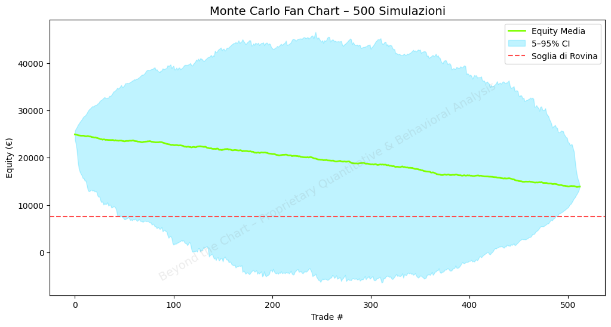

### Change Point Equity
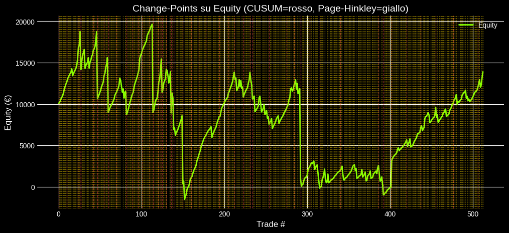

### Edge Decay Trend (Rolling Avg P/L – 30)

### Edge Decay Timeline

### Edge Collapse Root Cause Matrix

### Edge Early-Warning Panel
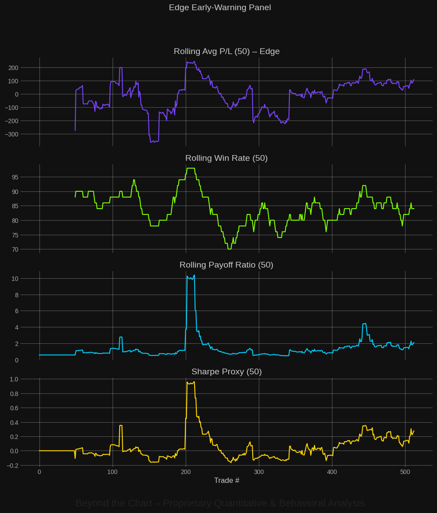

### Behavior–Structure Equilibrium Map

### Behavior vs Structure — Enhanced Sensitivity

### Behavior vs Structure — Stress Pressure

### Behavior vs Structure — Timeline

### ACF Returns

### PACF Returns

### Ulcer Index

### Sortino Stress — Downside Risk

### Beyond Risk Metrics — Table
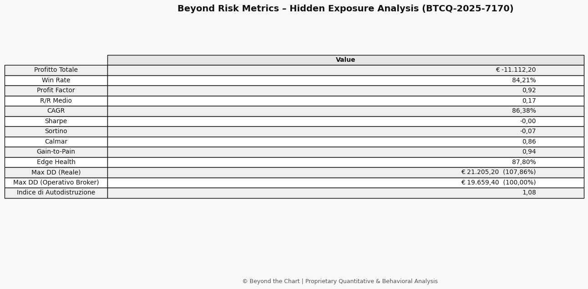

---

## Additional Metrics

### Return per Trade Distribution
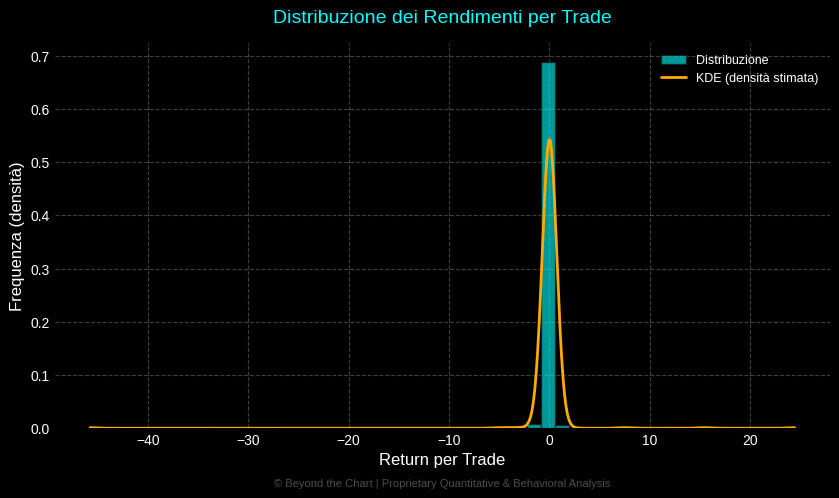  
Skew and tail structure evidencing asymmetry and non-Gaussian single-trade returns.

---

### QQ-Plot
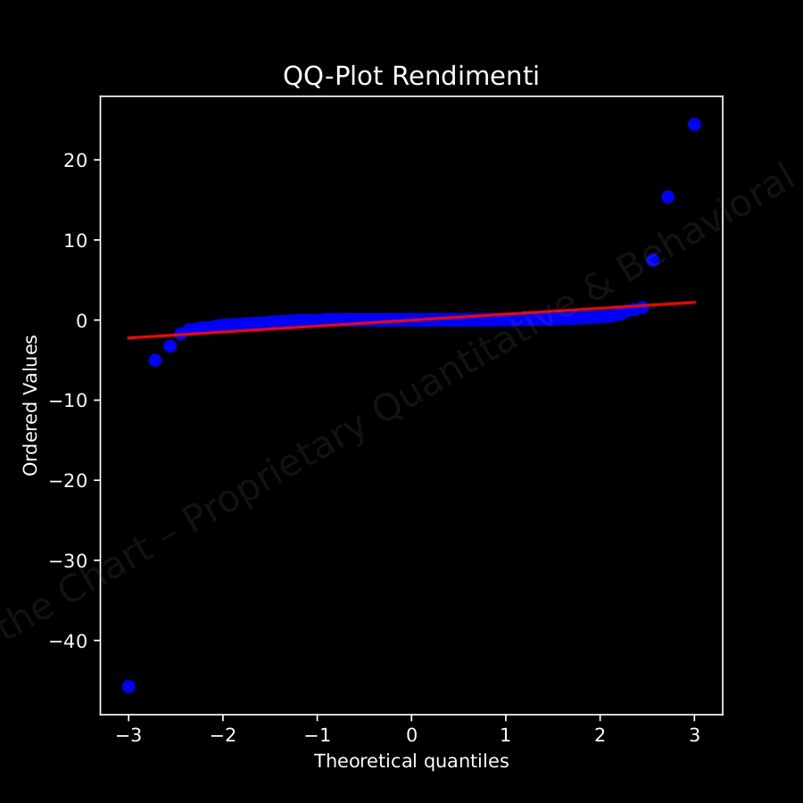  
Deviation from the Gaussian model highlighting excess kurtosis and fat-tail behavior.

---

### Tail Risk (VaR / CVaR)
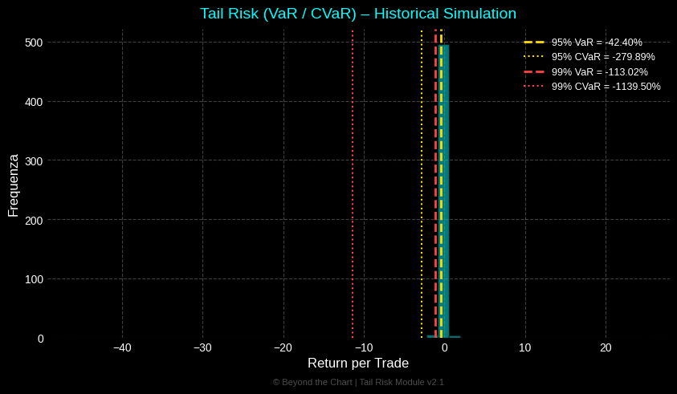  
Historical loss simulation at 95–99% confirming clustered volatility and heavy downside tails.

---

### Rolling Win Rate / Payoff Ratio
  
Behavioral consistency: joint evolution of win rate and payoff across volatility regimes.

---

### Hurst & ADF
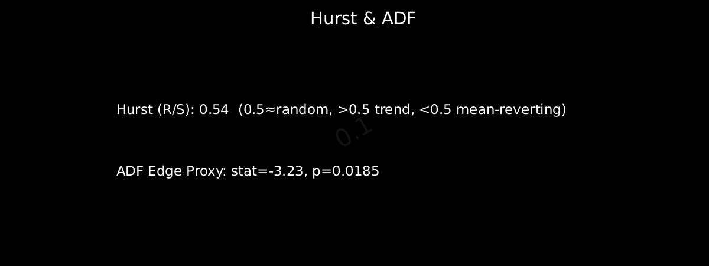  
Persistence and mean-reversion diagnostics of the equity process; lower values indicate edge decay.

---

### Edge Decay Trend (Rolling Avg P/L – 30)
  
Short-horizon rolling mean P/L capturing local decay within broader edge dynamics.

---

### Monte Carlo Simulation (500 runs)
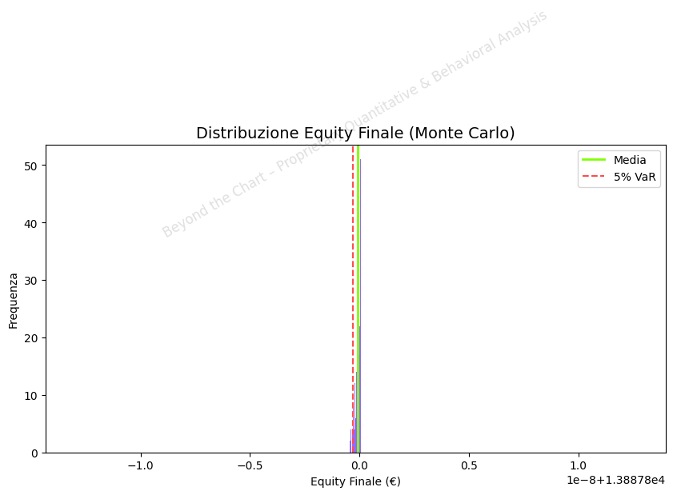  
Final equity distribution from 500 randomized trade-order paths, validating robustness under re-sequencing.

---

### Survival Probability
  
Cumulative likelihood of account persistence across the trade sequence horizon.

---

## Quantitative Performance Summary

| Metric | Value |
|:--|--:|
| **Total Net Profit** | −11,112.20 |
| **Win Rate (%)** | 84.21 |
| **Profit Factor** | 0.92 |
| **Average Win** | 305.74 |
| **Average Loss** | −1,767.81 |
| **CAGR (%)** | 86.38 |
| **Sharpe Ratio** | −0.13 |
| **Sortino Ratio** | −0.07 |
| **Calmar Ratio** | 0.80 |
| **Gain-to-Pain Ratio** | 0.94 |
| **Max Drawdown (%)** | 107.86 |
| **Edge Health (%)** | 87.63 |

---

## Quantitative Interpretation

1. **Performance Instability** — Despite an 84% win rate, the profit factor (0.92) and negative Sharpe/Sortino confirm structural inefficiency. The equity path exhibits recurrent drawdowns >100%, consistent with tail clustering.  
2. **Volatility Response** — Expansions in realized volatility magnify drawdown depth and reduce payoff stability. Rolling risk-adjusted metrics remain negative across most observation windows.  
3. **Tail Risk Exposure** — Historical simulation shows extreme CVaR (−279.89% at 95% and −1,139.50% at 99%), indicating that infrequent but severe losses dominate the distribution.  
4. **Edge Persistence & Drift** — Edge-decay and Hurst (0.54) indicate mild persistence with structural deterioration. The ADF statistic (−3.23, p=0.0185) rejects pure randomness, implying mean-reverting noise around a declining mean expectancy.  
5. **Monte Carlo & Survival Modeling** — The fan chart and survival curve imply a 60–70% probability of capital impairment beyond ~300 trades, consistent with edge erosion under variance amplification.

---

### Narrative Highlights

**Equity & Drawdown:** Alternating high-volatility clusters and deep drawdowns exceeding 100% confirm tail clustering typical of over-leveraged mean-reversion exposure.  
**VaR / CVaR:** Tail-risk simulation confirms disproportionate loss magnitude relative to trade frequency, revealing asymmetric downside dynamics.  
**Edge Decay:** Rolling mean P/L drifts downward after ~trade #300, signaling exhaustion of the initial structural advantage.

---

## Behavioral Layer

While the quantitative layer identifies edge decay, behavioral drift is visible in the frequency and amplitude of trade clustering.  
Periods of elevated trade density align with higher-volatility regimes and payoff asymmetry — a behavioral pattern linked to overconfidence and latent FOMO bias.  
These psychological signatures precede quantitative decay and serve as early-warning indicators of edge exhaustion.

---

## Conclusion

The S&P 500 trading account demonstrates **measurable performance decay** and **behavioral instability**.  
An initially positive edge deteriorates under volatility expansion, resulting in weaker risk-adjusted outcomes and recurring drawdowns.  
Without volatility normalization and disciplined risk controls, long-term expectancy remains statistically negative.

---

## Appendix

- **Tests executed:** Historical VaR/CVaR, ADF, Hurst R/S, CUSUM change-points, Monte Carlo (500 runs)  
- **Environment:** Python 3.12 — NumPy 2.1, SciPy 1.13, pandas 2.2, statsmodels 0.14  
- **Reproducibility:** All figures generated via reproducible scripts under `/src/`  
- **Metrics file:** `results/metrics_summary.csv`

---

### Glossary

- **Edge Decay:** Gradual loss of structural advantage observed through rolling P/L averages.  
- **Hurst Exponent:** Indicator of persistence or anti-persistence in time-series returns.  
- **VaR / CVaR:** Measures of extreme downside risk at specified confidence levels.  
- **Calmar Ratio:** Return-to-drawdown efficiency metric.  
- **Behavioral Drift:** Systematic psychological bias correlated with performance decay.

---

## Version History

- **v1.0 (Nov 2025)** — Initial full quantitative & behavioral report published.  
- **v1.1 (TBD)** — Integration of predictive drift metrics and behavioral clustering dashboard.

---

## Legal Notice

© 2025 Beyond the Chart — All rights reserved.  
This repository and its contents (data, code, and visual materials) are proprietary.  
No part of this report may be copied, redistributed, or used commercially without explicit written permission from Beyond the Chart.  
For institutional collaboration or partnership inquiries, contact: **[add your professional email or LinkedIn link]**
